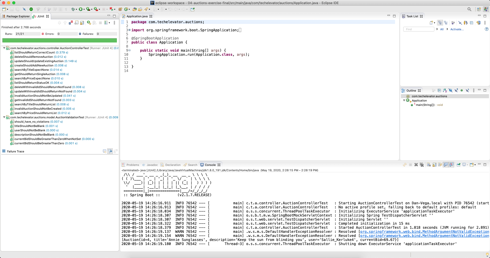

# Server-Side APIs: Part 2 Exercise (Java)

In this exercise, you'll add on to the auctions application you previously worked on. When you first built out the application, you added the ability to list, get, and search auctions by title and current bid. In this exercise, you’ll add the ability to update and delete auctions. You’ll also need to perform data validation to inform the client of any problems.

## Step One: Import project into Eclipse and explore starting code

Before you begin, import the starter code into Eclipse and review it. The code should look familiar to you as it's a continuation of the previous exercise.

### AuctionNotFoundException

You’ll find the class `AuctionNotFoundException` in the `com.techelevator.auctions.exception` package. `MemoryHotelDAO` throws this exception when a client tries to request an auction that doesn’t exist. Your job is to rethrow this method in your controller to notify the client that the auction they’re requesting doesn’t exist:

```java
@ResponseStatus( code = HttpStatus.NOT_FOUND, reason = "Auction Not Found")
public class AuctionNotFoundException extends Exception {
    private static final long serialVersionUID = 1L;  

    public AuctionNotFoundException(){
        super("Auction Not Found");
    }
}
```

> The `@ResponseStatus` annotation allows you to send a 404(NotFound) back to the client when `AuctionNotFoundException` is thrown.

Notice that the `get()` method in the `AuctionController` was updated to throw the `AuctionNotFoundException`:

```java
@RequestMapping(path = "/{id}", method = RequestMethod.GET)
public Auction get(@PathVariable int id) throws AuctionNotFoundException {
    return dao.get(id);
}
```

### Tests

The `src/test/java/com/techelevator/auctions/controller` package contains the `AuctionsControllerTest` class. It contains the tests you’ll write for this exercise. More tests pass after you complete each step. 

In `src/test/java/com/techelevator/auctions/model/AuctionValidationTest`, you’ll find a new set of unit tests. These tests verify that you’re validating incoming data.

Feel free to run the server and test the application in the browser, or in Postman. However, your focus should be on making sure the tests pass.

## Step Two: Modify the `create()` method

First, work on the `create()` method. When a new auction has been created, you’ll need to send a status code of `201(Created)` back to the client. After you complete this step, the `createShouldAddNewAuction` test passes. 

## Step Three: Add auction data validation

Right now, you can send in an object with a blank title, description, and user. Because there’s no data validation, the system creates one. You’ll need to add these rules to `Auction.Java`:

- title
  - rule: Not Blank
  - message: "The field `title` should not be blank."
- description
  - rule: Not Blank
  - message: "The field `description` should not be blank."
- user
  - rule: Not Blank
  - message: "The field `user` should not be blank."
- currentBid
  - rule: Min 1
  - message: "The field `current bid` should be greater than 0."
  - * current bid is a double, so you can't use the rule `@Min()`.

Afterwards, run the unit tests in `src/test/java/com/techelevator/auctions/model/AuctionValidationTest.java` to verify that you have the correct validations in place.

## Step Four: Update the controller's `create()` method

To enforce validation in the controller, add an annotation before the `Auction` argument in the `create()` method to tell Spring to validate the object. If completed properly, the `invalidAuctionShouldNotBeCreated()` test passes. 

## Step Five: Implement the `update()` method

This method updates a specific auction. The new auction is passed in as an argument.

In `AuctionController.Java`, create a method named `update()` that accepts an `Auction`, the auction’s ID, and returns the updated `Auction`. Then add the `@RequestMapping` annotation to this method so it responds to `PUT` requests for `/auctions` with a number following it, like `/auctions/7`. Next, pass a value to the path to tell it to accept a dynamic parameter. 

This method must also:

* Return an `Auction` from `dao.update()`, passing it the auction and ID that was passed to the method. 
* Be able to respond to the client when an invalid ID is passed to it.

After you complete this step, the `updateShouldUpdateExistingAuction()`, `invalidAuctionShouldNotBeUpdated()` and `updateWithInvalidIdShouldReturnNotFound()` tests pass.

## Step Six: Implement the `delete()` method

This method deletes a specific auction. 

In `AuctionController.Java`, create a method named `delete()` that accepts an `int` and returns `void`. Then add the `@RequestMapping` annotation to the method so it responds to `DELETE` requests for `/auctions` with a number following it. Next, pass a value to the path to tell it to accept a dynamic parameter.

This method must also:

* Call `dao.delete()`, passing it the ID that was passed to the method.
* Send a `204(No Content)` status code back to the client, as the method doesn’t return a value.
* Respond to the client when an invalid auction ID is passed to it.

If completed properly, the `deleteShouldRemoveAuction()` and `deleteWithInvalidIdShouldReturnNotFound()` tests pass.

---

If you followed the instructions correctly, all tests now pass. 


